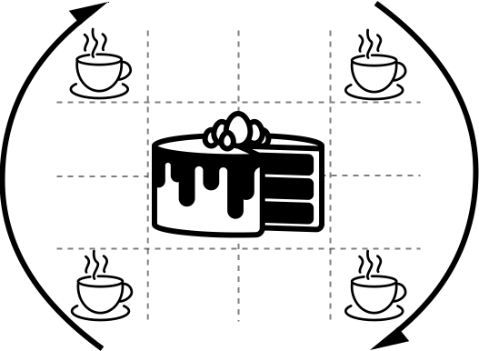

# MatchCake

<div style="text-align:center"></div>

[](https://github.com/JeremieGince/MatchCake/stargazers)
[](https://www.python.org/downloads/release/python-390/)
[](LICENSE)


# Description

MatchCake is a python package that provide a new [PennyLane](https://pennylane.ai/) device to simulate a particular 
type of quantum circuits 
called Matchgate circuits or matchcircuits. Those circuits are made with Matchgates, a specific group of 
parity-preserving gates and nearest-neighbor unitary gates that can be simulated classically in polynomial time.

Additionnaly, MatchCake provides quantum kernels made with [scikit-learn](https://scikit-learn.org/stable/) 
API to use matchcircuits as a kernel in
quantum machine learning algorithms. Those kernels can be used in a Support Vector Machine (SVM) for example.
In the [benchmark/classification](benchmark/classification/README.md) folder, you can find some scripts that use SVM with
matchcircuits as a kernel to classify the Iris dataset, the Breast Cancer dataset and the Digits dataset in 
polynomial time with a high accuracy.


# Installation

| Method     | Commands                                                                                                                                                                        |
|------------|---------------------------------------------------------------------------------------------------------------------------------------------------------------------------------|
| **source** | `pip install git+https://github.com/JeremieGince/MatchCake`                                                                                                                     |
| **wheel**  | 1.Download the .whl file [here](https://github.com/JeremieGince/MatchCake/tree/main/dist);<br> 2. Copy the path of this file on your computer; <br> 3. `pip install [path].whl` |


### Last unstable version
To install the last unstable version, you can install it by downloading the last version of the .whl file
and following the instructions above.


# Quick Usage Preview
```python
import matchcake as mc

```

# Tutorials

- [MatchCake Basics](tutorials/MatchCakeBasics.ipynb)
- [Iris Classification with MatchCake](tutorials/IrisClassification.ipynb)


# Why MatchCake?


# Similar Works


# About


# Important Links
  - Documentation at [https://JeremieGince.github.io/MatchCake/](https://JeremieGince.github.io/MatchCake/).
  - Github at [https://github.com/JeremieGince/MatchCake/](https://github.com/JeremieGince/MatchCake/).


# Found a bug or have a feature request?
- [Click here to create a new issue.](https://github.com/JeremieGince/MatchCake/issues/new)


# License
[Apache License 2.0](LICENSE)


# Citation
```
@misc{matchcake_Gince2023,
  title={Matchgate Circuits using Non-Interacting Fermionic Simulation},
  author={Jérémie Gince},
  year={2023},
  publisher={Université de Sherbrooke},
  url={https://github.com/JeremieGince/FermionicSimulation},
}
```

